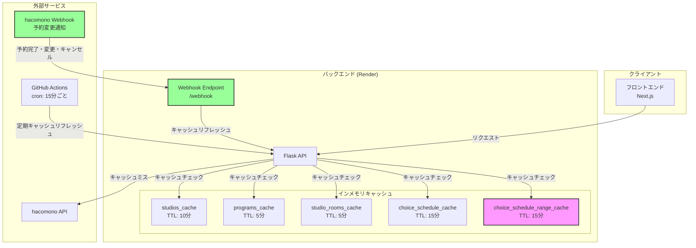
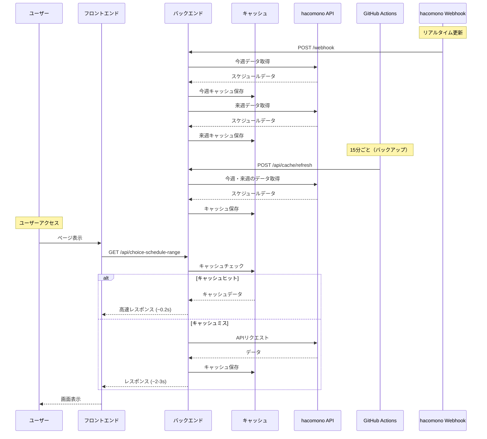

# キャッシュアーキテクチャ

## 概要

本システムは、hacomono APIへの負荷軽減とユーザー体験向上のため、多層キャッシュ機構を実装しています。

## アーキテクチャ図

### 全体フロー



### キャッシュ更新フロー



### 予約完了時のキャッシュ更新


## キャッシュ一覧

| キャッシュ名 | TTL | キーパターン | 用途 |
|-------------|-----|-------------|------|
| `studios_cache` | 10分 | (単一) | 店舗一覧 |
| `programs_cache` | 5分 | `studio_id` or `"all"` | プログラム一覧 |
| `studio_rooms_cache` | 5分 | `studio_id` or `"all"` | スタジオルーム一覧 |
| `choice_schedule_cache` | 15分 | `{room_id}:{date}` | 日別スケジュール（基本データ） |
| `choice_schedule_range_cache` | 15分 | `{room_id}:{date_from}:{date_to}:{program_id}` | 週別スケジュール（完全データ） |
| `instructor_studio_map_cache` | 60秒 | (単一) | スタッフ-店舗紐付け |
| `resources_cache` | 5分 | `studio_id` | 設備情報 |

## キャッシュキーの設計

### choice_schedule_range_cache のキー構造

```
{studio_room_id}:{date_from}:{date_to}:{program_id or "none"}

例:
- 4:2025-12-25:2025-12-31:7      # 今週 + program_id=7
- 4:2025-12-25:2025-12-31:none   # 今週 + program_idなし
- 4:2026-01-01:2026-01-07:7      # 来週 + program_id=7
```

### フロントエンドのリクエストパターン


フロントエンドは `currentWeekStart` から7日間のデータをリクエストするため、キャッシュもこの単位で分割されます。

## キャッシュ更新トリガー

### 1. hacomono Webhook（リアルタイム更新）

```
POST /webhook
```

hacomonoの管理画面で予約が変更された際に、Webhookでリアルタイムに通知を受け取りキャッシュを更新します。

**対応イベントタイプ:**
- `SCHEDULE_RESERVATION_RESERVE` - 予約完了
- `SCHEDULE_RESERVATION_RESERVE_CHANGE` - 予約変更
- `SCHEDULE_RESERVATION_CANCEL` - 予約キャンセル

**セットアップ:**

| 環境 | URL | シークレット |
|------|-----|-------------|
| 開発 | `http://localhost:5011/webhook` | `LgXlSZxYolYGqoPtAnGnJmMd1jSZOony` |
| 本番 | `https://happle-reservation-backend.onrender.com/webhook` | `EX9duM782dv8oKDXV6ik1bOUoIZkW8hX` |

1. hacomono管理画面でWebhook設定を作成
2. URL: 上記表を参照
3. 対象イベント: 予約完了、予約変更、予約キャンセル
4. シークレットを環境変数 `HACOMONO_WEBHOOK_SECRET` に設定

**署名検証:**
- `X-Webhook-Event` ヘッダーのHMAC-SHA256署名を検証
- タイムスタンプの鮮度チェック（5分以内）

**キャッシュ更新:**
- **対象**: 全CHOICEルームの今週・来週のスケジュール
- フロントエンドのリクエストパターンに合わせて、今週(0-6日)と来週(7-13日)を**別々のキャッシュキー**で更新
- これにより、フロントエンドからのリクエストが確実にキャッシュヒットする

```python
# 今週: today ~ today+6
refresh_all_choice_schedule_cache(client, days=7)
# 来週: today+7 ~ today+13
refresh_all_choice_schedule_cache(client, days=7, start_offset_days=7)
```

### 2. GitHub Actions (cron)

```yaml
schedule:
  - cron: '*/15 * * * *'  # 15分ごと
```

- **対象**: 指定した `studio_ids` の今週・来週のスケジュール
- **目的**: 最初のユーザーも高速にアクセスできるようプリキャッシュ、Webhookのバックアップ

### 4. 予約完了時

```python
# バックグラウンドでキャッシュリフレッシュ
Thread(target=refresh_cache_background, daemon=True).start()
```

- **対象**: 予約が入った店舗ルームの今週・来週
- **目的**: 予約状況の即時反映、次のユーザーの高速アクセス

### 5. ユーザーリクエスト時（キャッシュミス）

```python
# キャッシュミス時、APIから取得後に自動キャッシュ
response_data = refresh_choice_schedule_range_cache(...)
```

- **対象**: リクエストされた範囲
- **目的**: 次のユーザーの高速アクセス

## パフォーマンス

### 測定結果

| エンドポイント | キャッシュミス | キャッシュヒット | 高速化率 |
|---------------|--------------|----------------|---------|
| `/api/programs` | ~1.3s | ~0.2s | **6.5x** |
| `/api/choice-schedule-range` (7日) | ~2-3s | ~0.2-0.3s | **10x** |

### ボトルネック分析


## リスクと対策

### 1. インメモリキャッシュの消失

| リスク | 影響 | 対策 |
|--------|------|------|
| サーバー再起動 | 全キャッシュ消失 | cronが15分以内に再構築 |
| Renderのコールドスタート | キャッシュなし | 初回リクエストで自動構築 |


### 2. キャッシュの整合性

| リスク | 影響 | 対策 |
|--------|------|------|
| 予約後のキャッシュ不整合 | 空き枠が古い状態で表示 | 予約完了時にキャッシュリフレッシュ |
| hacomono側での直接変更 | キャッシュと実データの乖離 | TTL 15分で自動更新、cronで定期更新 |

### 3. メモリ使用量

| リスク | 影響 | 対策 |
|--------|------|------|
| キャッシュ肥大化 | メモリ不足 | studio_ids指定で対象店舗を限定 |

**現在のキャッシュサイズ見積もり**:
- 1店舗 × 2週間 × 2パターン（今週・来週）= 約4エントリ
- 1エントリ ≈ 50-100KB
- 10店舗で約4-8MB（Renderの無料プランでも問題なし）

### 4. GitHub Actions の制限

| リスク | 影響 | 対策 |
|--------|------|------|
| 無料枠超過 | 課金発生 | 15分間隔に設定（月2,880分 < 無料枠3,000分） |
| Actions障害 | キャッシュ未更新 | ユーザーリクエスト時の自動キャッシュで補完 |

### 5. セキュリティ

| リスク | 影響 | 対策 |
|--------|------|------|
| キャッシュリフレッシュAPIの不正利用 | サーバー負荷 | `X-Cache-Refresh-Key` ヘッダーで認証 |

```python
# キャッシュリフレッシュAPIの認証
secret_key = request.headers.get("X-Cache-Refresh-Key")
if secret_key != os.environ.get("CACHE_REFRESH_SECRET_KEY"):
    return jsonify({"error": "Unauthorized"}), 401
```

## 運用

### キャッシュ状態の確認

```bash
# キャッシュステータス確認
curl -H "X-Cache-Refresh-Key: YOUR_SECRET_KEY" \
  "https://happle-reservation-backend.onrender.com/api/cache/status"
```

### 手動キャッシュリフレッシュ

```bash
# 特定店舗のキャッシュをリフレッシュ
curl -X POST -H "X-Cache-Refresh-Key: YOUR_SECRET_KEY" \
  "https://happle-reservation-backend.onrender.com/api/cache/refresh?days=14&studio_ids=4"
```

### GitHub Actions 手動実行

1. GitHub リポジトリの「Actions」タブを開く
2. 「Refresh Cache」ワークフローを選択
3. 「Run workflow」をクリック
4. パラメータを入力して実行

## 将来の拡張案

### 1. Redis への移行


**メリット**:
- サーバー再起動でもキャッシュ維持
- 複数インスタンス間でキャッシュ共有
- より高度なキャッシュ制御（LRU、パターン削除など）

### 2. CDN キャッシュ

静的なデータ（店舗情報、プログラム情報）はCDNでキャッシュ可能。

### 3. キャッシュウォーミング

営業開始前に全店舗のキャッシュを事前構築。

```yaml
# 例: 毎朝6時に全店舗キャッシュ
schedule:
  - cron: '0 6 * * *'
```

## 関連ファイル

- `happle-reservation/backend/app.py` - キャッシュ実装
- `.github/workflows/refresh-cache.yml` - cron設定
- `happle-reservation/env.example` - 環境変数

## 変更履歴

| 日付 | 変更内容 |
|------|----------|
| 2025-12-25 | 初版作成 |
| 2025-12-25 | 週単位キャッシュ分割実装 |
| 2025-12-25 | 予約完了時のキャッシュリフレッシュ実装 |
| 2025-12-25 | hacomono Webhook対応（予約・休憩・ブロック変更のリアルタイム反映） |
| 2025-12-25 | Webhookキャッシュ更新を今週・来週分割に修正（キャッシュキー一致のため） |


