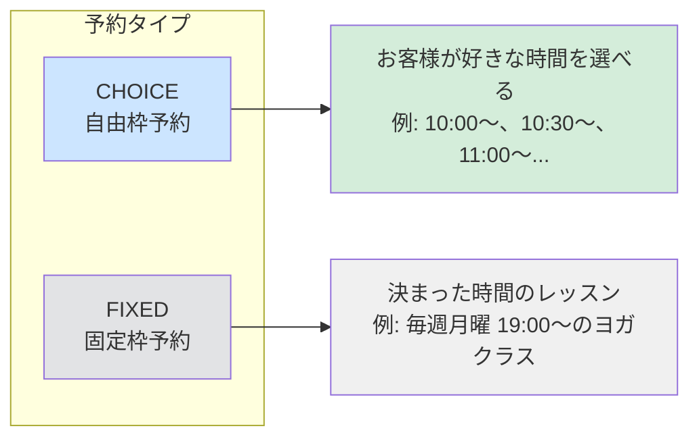
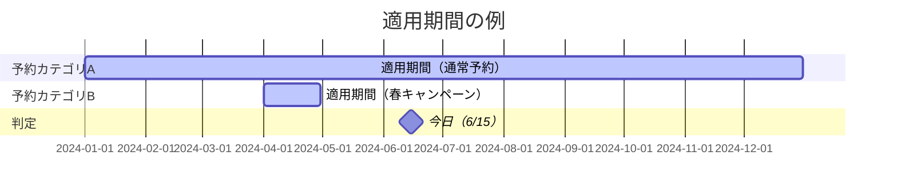
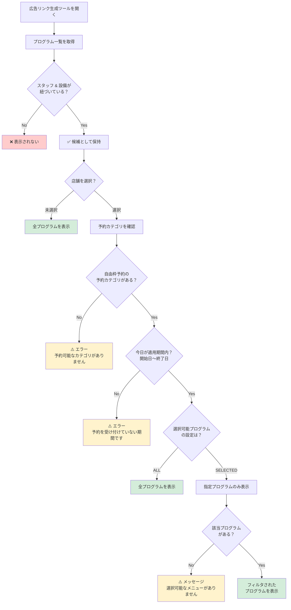
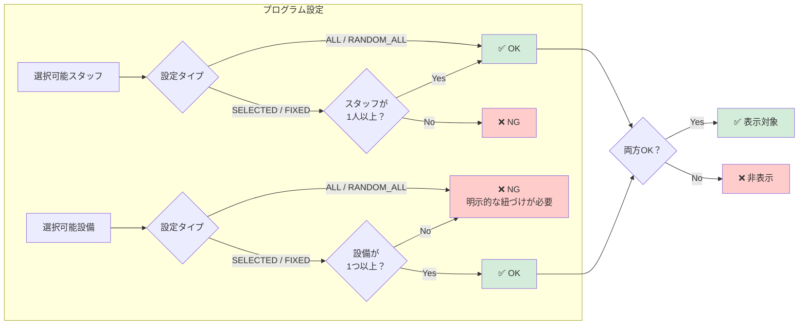
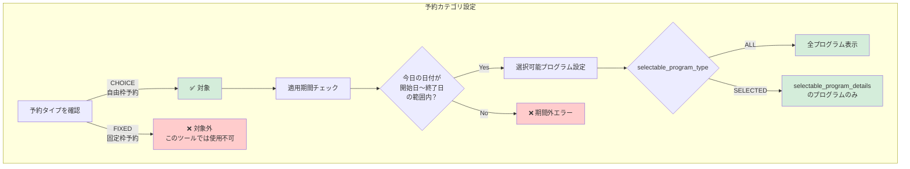
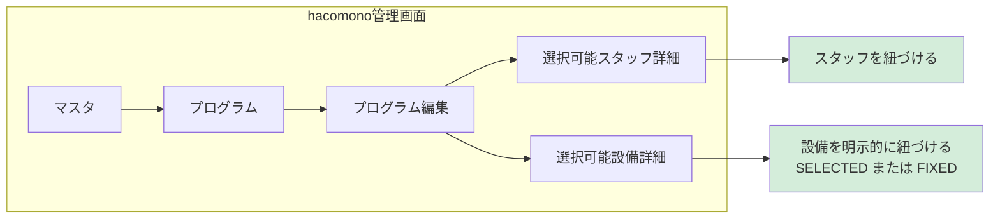
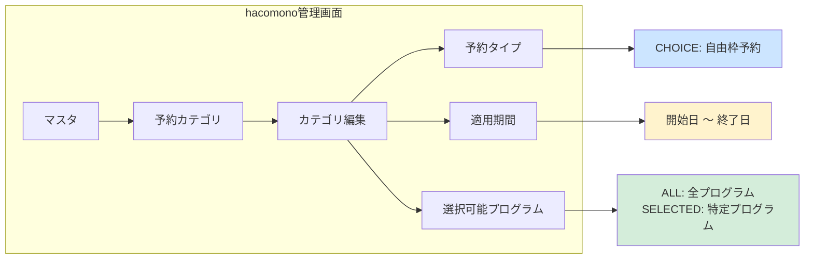
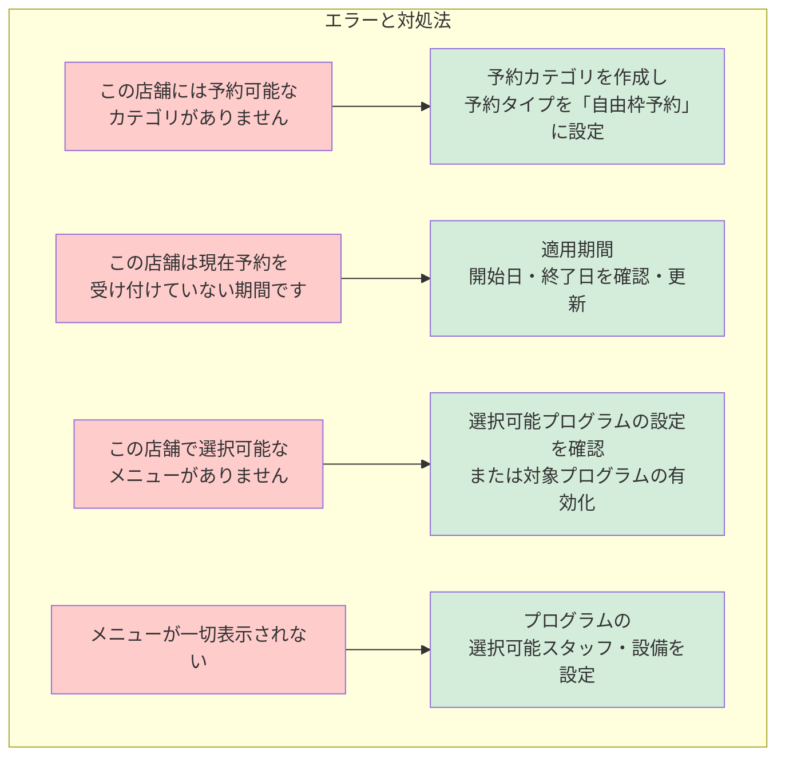
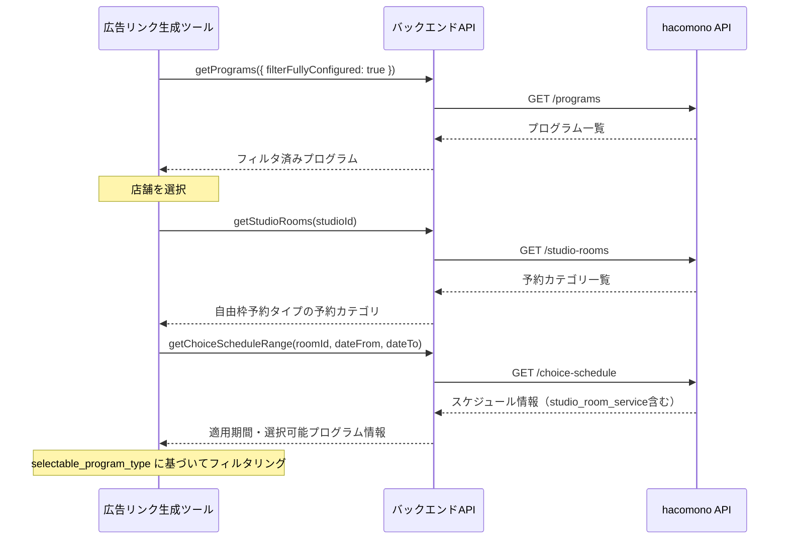
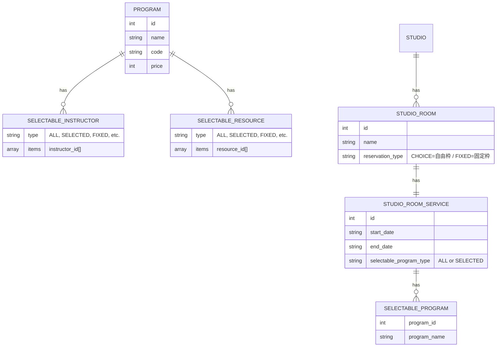

# 広告リンク生成ツール「メニュー選択」ロジック

## 概要

広告リンク生成ツール（`/admin/link-generator`）の「メニューを選択」ドロップダウンに表示されるメニュー（プログラム）は、**hacomonoの管理画面で設定した内容**に基づいてフィルタリングされます。

---

## 用語説明

### 予約カテゴリとは

hacomonoの管理画面で **「マスタ → 予約カテゴリ」** にある設定のことです。

**1店舗に複数の予約カテゴリを作ることができます。** 例えば：

| 予約カテゴリ名 | 用途 |
|--------------|------|
| 「パーソナルトレーニング予約」 | マンツーマン施術用 |
| 「グループレッスン」 | 固定時間のクラス用 |
| 「体験予約」 | 初回体験者用 |

### 予約タイプ（CHOICE と FIXED）

各予約カテゴリには「予約タイプ」を設定します。2種類あります：

| 予約タイプ | 日本語名 | 説明 |
|-----------|---------|------|
| **CHOICE** | 自由枠予約 | お客様が空いている時間から自由に選んで予約できる |
| **FIXED** | 固定枠予約 | あらかじめ決まったレッスン枠に予約する |

> ⚠️ **重要**: この広告リンク生成ツールは **「自由枠予約（CHOICE）」専用** です。固定枠予約（FIXED）の予約カテゴリは対象外となります。

### 適用期間とは

予約カテゴリに設定する **「いつからいつまで予約を受け付けるか」** の期間設定です。

| 設定項目 | 説明 | 例 |
|----------|------|-----|
| **開始日（start_date）** | この日から予約を受け付け開始 | 2024-01-01 |
| **終了日（end_date）** | この日まで予約を受け付け | 2024-12-31 |

#### 判定例

| 適用期間の設定 | 今日の日付 | 結果 |
|---------------|-----------|------|
| 2024-01-01 〜 2024-12-31 | 2024-06-15 | ✅ 期間内 → メニュー表示される |
| 2024-01-01 〜 2024-03-31 | 2024-06-15 | ❌ 期間終了 → エラー表示 |
| 2025-01-01 〜 2025-12-31 | 2024-06-15 | ❌ まだ開始前 → エラー表示 |

#### なぜ適用期間が必要？

- **キャンペーン期間限定の予約** を設定できる
- **シーズンごとの予約切り替え** ができる
- **将来の予約受付開始日** を事前に設定できる

### 確認場所

**hacomono管理画面: マスタ → 予約カテゴリ → [カテゴリを選択]**

設定画面で「予約タイプ」が「自由枠予約」になっているかを確認してください。

---

## メニュー表示のフローチャート

---

## プログラムの表示条件

### 条件1: スタッフと設備の紐づけ（必須）

### 条件2: 予約カテゴリの設定（店舗選択時）

店舗を選択すると、その店舗の **予約カテゴリ** の設定をチェックします。

---

## hacomono管理画面での設定場所

### 1. プログラムの設定

**マスタ → プログラム → [プログラム名] → 編集**

| 設定項目 | 必要な条件 |
|----------|-----------|
| **選択可能スタッフ** | スタッフが1人以上紐づいている（「全スタッフ」設定でもOK） |
| **選択可能設備** | 設備が**明示的に**紐づいている（「全設備から選択」はNG） |

### 2. 予約カテゴリの設定

**マスタ → 予約カテゴリ → [カテゴリ名] → 編集**

| 設定項目 | 説明 |
|----------|------|
| **予約タイプ** | 「自由枠予約（CHOICE）」を選択 |
| **適用期間** | いつからいつまで予約を受け付けるか（開始日・終了日） |
| **選択可能プログラム** | 「ALL」＝全プログラム / 「SELECTED」＝特定のプログラムのみ |

---

## エラーメッセージと対処法

| エラーメッセージ | 原因 | 対処法 |
|-----------------|------|--------|
| 「この店舗には予約可能なカテゴリがありません」 | 自由枠予約（CHOICE）の予約カテゴリがない | 予約カテゴリを作成し、予約タイプを「自由枠予約」に設定 |
| 「この店舗は現在予約を受け付けていない期間です」 | 予約カテゴリの適用期間外 | 適用期間（開始日・終了日）を確認・更新 |
| 「この店舗で選択可能なメニューがありません」 | 予約カテゴリで選択可能プログラムが設定されていない | 選択可能プログラムの設定を確認 |
| メニューが一切表示されない | プログラムにスタッフまたは設備が紐づいていない | プログラムの「選択可能スタッフ」「選択可能設備」を設定 |

---

## 関連APIドキュメント

- [hacomono API ドキュメント](https://hacomono.github.io/hacomono-documents/api-admin/index.html)
  - プログラム検索・取得
  - 予約カテゴリ検索・取得
  - 自由予約受付設定

---

## 技術的な補足

### データ取得の流れ

### 主要なデータ構造

